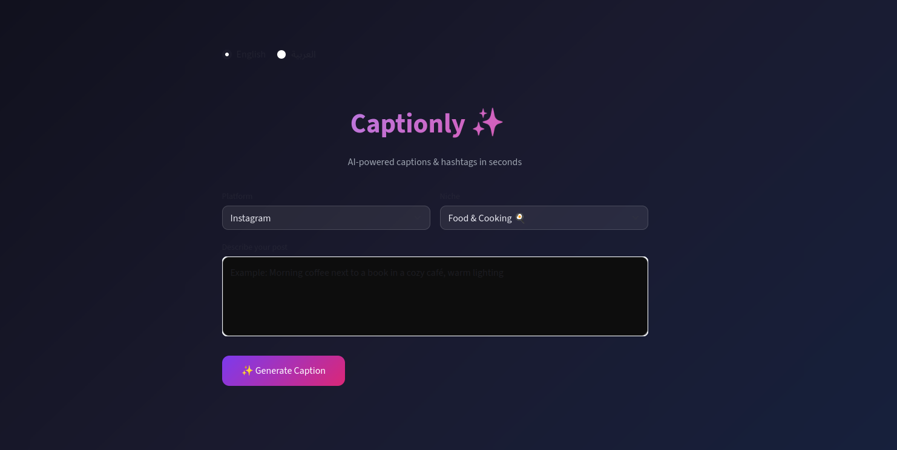

---

# 🎨 UI Preview

---

# 🚀 What is Captionly?

Captionly is an AI-powered web app that generates **high-quality social media captions, hashtags, and posting tips** for content creators.

It is designed to help you create **viral-ready posts in seconds** for:

- 📸 Instagram
- 🎵 TikTok

---

# 🧠 AI Features

The app uses **Google Gemini API** with advanced prompt engineering to generate:

- ✨ Well-structured captions optimized for engagement  
- 🔥 Advanced hashtag strategies for better reach  
- 📈 Platform-specific posting suggestions  
- 🌍 Support for **English and Arabic**

---

# 💡 How it works

1. User enters a post idea (example: coffee shop, fitness, travel)
2. The app sends a structured prompt to Gemini AI
3. The model returns:
   - Caption
   - Hashtags
   - Posting tips
4. Results are shown in a clean UI for easy copy & use

---

# 📊 Posting Tips (Included Feature)

Captionly also gives smart suggestions like:

- Best time to post
- Hashtag strategy
- Engagement optimization tips
- Audience targeting ideas

---

# 🌍 Language Support

- English 🇺🇸
- Arabic 🇸🇦

The app dynamically adapts prompts based on selected language for better AI output quality.

---

# ⚙️ Tech Stack

- Python 🐍
- Streamlit 🎈
- Google Gemini API 🤖
- Docker 🐳
- Prompt Engineering 🧠

---

# 🚀 Goal of this project

To help creators:
> Generate better content, faster, with AI assistance.

---How to run it

Add Your Gemini API Key

Create a .env file in the project root:

touch .env

Then open it and add:

GEMINI_API_KEY=your_gemini_api_key_here

👉 You can get your API key from Google Gemini AI Studio.

🐳 3. Run with Docker (Recommended)
Step 1: Build the image
docker build -t captionly .
Step 2: Run the container
docker run -p 8501:8501 --env-file .env captionly
Step 3: Open the app
http://localhost:8501
💻 4. Run WITHOUT Docker (Alternative)

If you don’t want Docker:

Step 1: Create virtual environment
python3 -m venv venv
source venv/bin/activate
Step 2: Install dependencies
pip install -r requirements.txt
Step 3: Run the app
streamlit run app.py